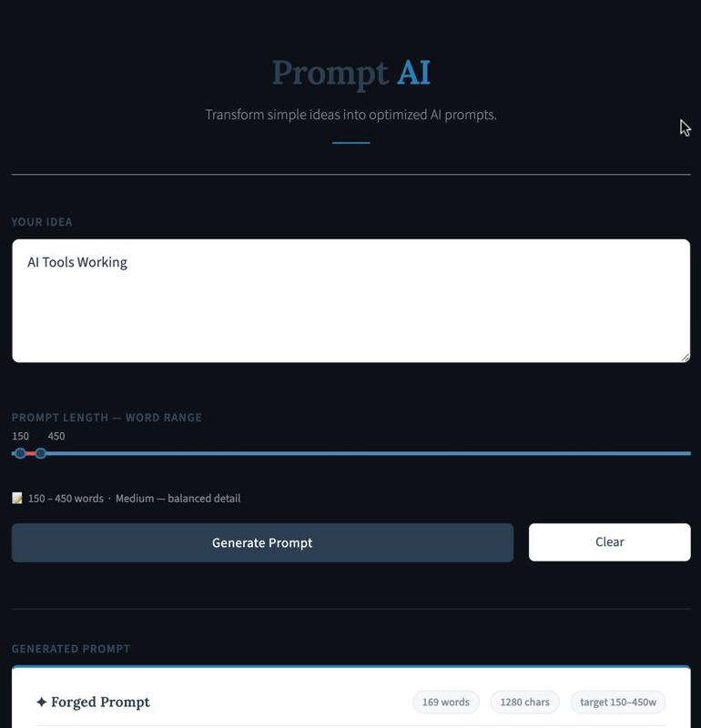
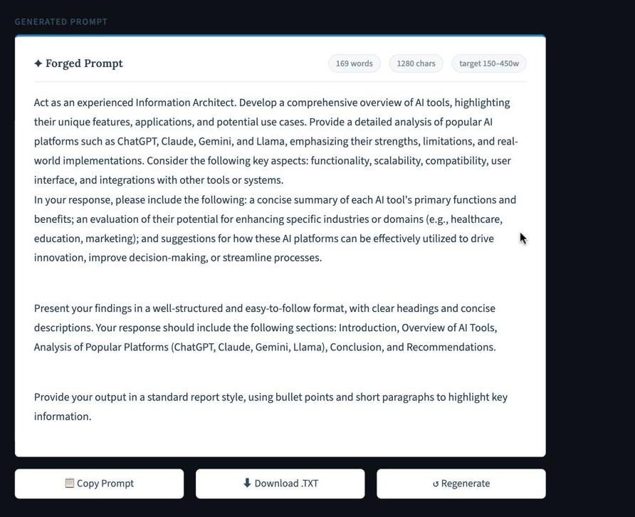

# Prompt AI

Prompt AI is an intelligent prompt generation application powered by Ollama and Llama 3. The system transforms simple user ideas into detailed, optimized, and ready-to-use prompts suitable for AI tools such as ChatGPT, Claude, Gemini, and Llama.

---

## Features

* Generate professional AI prompts from plain English ideas
* Adjustable prompt length (100–10,000 words)
* Modern and minimal Streamlit interface
* Local AI inference using Ollama
* Download generated prompts as text files
* Word and character count tracking
* Works completely offline after model installation

---

## Technology Stack

* Python
* Streamlit
* Ollama
* Llama 3
* Requests

---

## Project Structure

```text
Prompt-AI/
│
├── app.py
├── requirements.txt
└── README.md
```

---

## Installation

### Clone Repository

```bash
git clone https://github.com/vardhanbachu/Prompt-AI.git

cd prompt-ai
```

### Create Virtual Environment

```bash
python -m venv venv
```

Windows:

```bash
venv\Scripts\activate
```

Mac/Linux:

```bash
source venv/bin/activate
```

### Install Dependencies

```bash
pip install -r requirements.txt
```

---

## Install Ollama

Download and install Ollama from:

https://ollama.com

Verify installation:

```bash
ollama --version
```

---

## Download Llama 3 Model

```bash
ollama pull llama3
```

---

## Start Ollama Server

```bash
ollama serve
```

The Ollama API will run on:

```text
http://localhost:11434
```

---

## Run the Application

```bash
streamlit run app.py
```

The application will open in your browser.

---

## How It Works

1. Enter a rough idea in plain English.
2. Select the desired prompt length.
3. Click Generate Prompt.
4. The idea is sent to Ollama running Llama 3.
5. Llama 3 creates a detailed and optimized prompt.
6. Copy or download the generated prompt.

---

## Example Input

```text
Create a website for a gym
```

### Example Output

```text
Act as an experienced web developer.

Design a modern and responsive fitness website for a gym. Include a hero section, membership plans, trainer profiles, testimonials, contact information, and mobile-friendly navigation. Focus on user engagement, clean design, and professional presentation.
```

---

## Requirements

```text
streamlit>=1.35.0
requests>=2.31.0
```

---

## Future Enhancements

* Prompt templates
* Prompt history
* Export as PDF
* Multiple AI model support
* Prompt quality scoring
* User authentication

---
## Output

### Input Screen



### Output Screen



---
## Author

Vardhan Bachu
